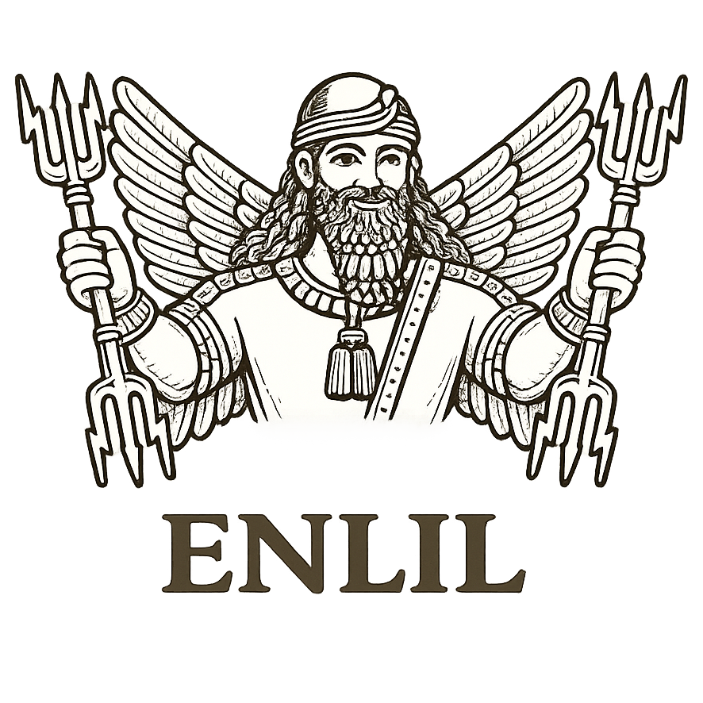

# 

# Enlil
Sistema de organización de proyectos (PHP + XML + JS) con administración única.

## Funcionalidades
- Registro y login de un único usuario administrador.
- Equipos y personas con integración Telegram (grupos, bot, checklists).
- Proyectos con objetivos y tareas (dependencias, responsables, estado).
- Vista de proyecto con organigrama de objetivos y dependencias.
- Calendarios por proyecto y por persona (vista semanal/mensual).
- Envío de mensajes y checklists con tareas pendientes (horizonte 15 días).
- Automatización diaria de envíos a las 07:00.

## Requisitos
- PHP 8+ (sin base de datos: se usa XML).
- Extensión `curl` recomendada.
- Servidor web (Apache/Nginx).

## Instalación
1. Apunta el docroot del dominio a este directorio.
2. Da permisos de escritura a `data/` (por ejemplo, `chmod 770 data/`).
3. Accede al dominio y crea el usuario administrador.
4. En **Panel** configura el bot de Telegram y activa el webhook.
5. Si vas a usar checklists de Telegram Business, conecta el bot en Telegram Business.

## Configuración en Telegram
- Crea el bot en @BotFather y guarda el token.
- Enlil usa **un único bot global** para toda la instalación (Panel).
- Añade el bot como administrador en los grupos de cada equipo.
- Activa el webhook desde el Panel (“Activar webhook”).
- Para checklists de Telegram Business: conecta el bot en Telegram Business y asegúrate de que los usuarios inicien chat privado con el bot.

## Cron diario (07:00)
El envío diario se ejecuta con:
```
/usr/bin/php /var/www/html/maximalismo/formacion/proyectos_send_daily.php
```
Ejemplo de crontab:
```
0 7 * * * /usr/bin/php /var/www/html/maximalismo/formacion/proyectos_send_daily.php >> /var/www/html/maximalismo/formacion/data/cron.log 2>&1
```

## Estructura del proyecto
- `includes/` lógica PHP (XML, Telegram, auth).
- `assets/` estilos y recursos.
- `data/` XML y logs (no se versiona).
- `proyectos_send_daily.php` envío diario automatizado.
- `telegram_webhook.php` recepción de eventos (checklists, business, etc).

## Licencia
Licencia Pública de la Unión Europea **EUPL v1.2** (equivalente a una GPL3).  
Consulta `LICENSE.txt`.
